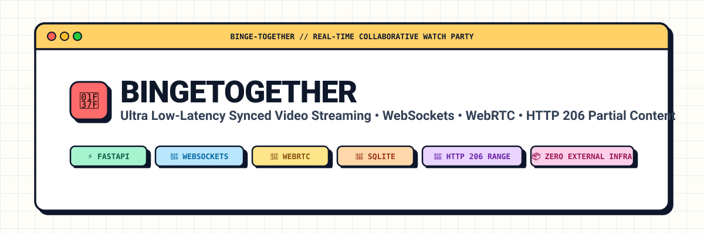
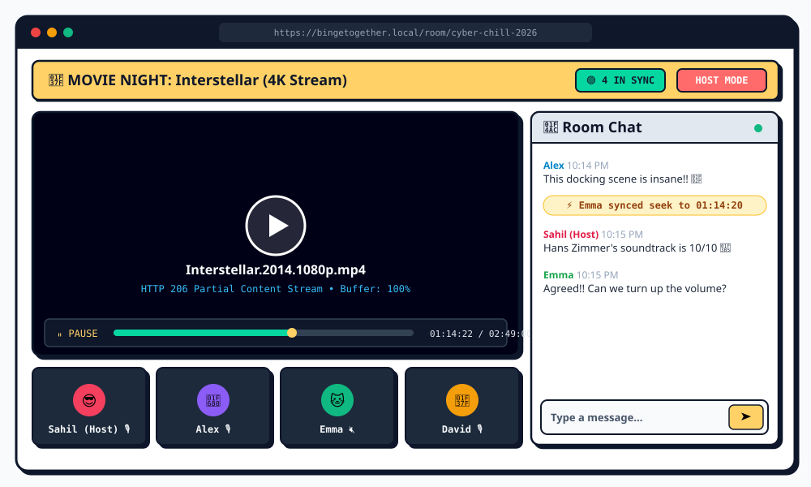
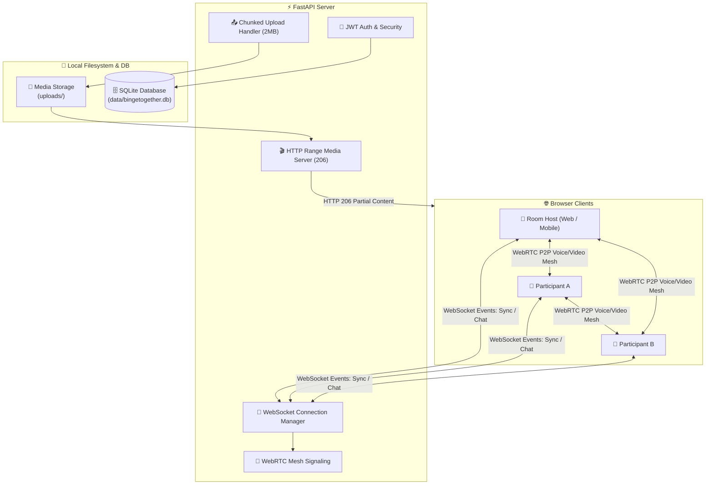

# 🍿 BingeTogether — Real-Time Synced Watch Party Platform

<p align="center">
  
</p>

<p align="center">
  <a href="#-key-features"></a>
  <a href="#-key-features"></a>
  <a href="#-key-features"></a>
  <a href="#-key-features"></a>
  <a href="#-key-features"></a>
  <a href="#-license"></a>
</p>

---

## 📖 Overview

**BingeTogether** is a self-contained, high-performance collaborative watch-party platform designed for seamless synchronized video streaming among friends and communities.

Watch **YouTube videos** or **uploaded local MP4 files** with sub-second synchronization, client-side chunked resumable file uploads, HTTP 206 Partial Content range streaming, real-time in-room text chat, and integrated peer-to-peer **WebRTC audio/video calling**.

> 💡 **Zero External Infrastructure:** No Docker, Redis, Kafka, MySQL, or cloud media servers required. Operates completely standalone using FastAPI, an embedded SQLite database, and local disk storage.

---

## 📸 Screenshots & UI Preview

### 🎬 Watch Party Room (Video Sync + WebRTC Grid + Live Chat)
<p align="center">
  
</p>

---

## ✨ Key Features

| Feature | Description |
| :--- | :--- |
| ⚡ **Real-Time Playback Sync** | Synchronizes **Play, Pause, Seek, and Current Time** across all participants over low-latency WebSockets. |
| 🎥 **Dual Media Support** | Stream **YouTube** (via IFrame Player API) or **Direct MP4s** (via HTML5 Video API). |
| 🎙️ **WebRTC Voice & Video** | Integrated peer-to-peer audio and video mesh calling with microphone mute and camera toggles. |
| 📤 **Resumable Chunked Uploads** | Large MP4s are sliced into 2MB chunks client-side for fault-tolerant upload and assembly. |
| 🚀 **HTTP Range Streaming** | Endpoint `/api/media/stream/{file_id}` implements `206 Partial Content` for instant seeking without loading the full video into memory. |
| 👑 **Host Control Privileges** | Toggle between **Host-Only Control** (only room creator can seek/pause) and **Open Control** (anyone can control). |
| 💬 **In-Room Live Chat** | Persistent chat message stream with system join/leave and sync event notifications. |
| 🔐 **JWT Auth & User Profiles** | Secure registration, password hashing (bcrypt), token authentication, avatars, and profile editing. |
| 🛡️ **Comprehensive Admin Panel** | Manage users, view active watch party rooms, monitor live connections, and close rooms on demand. |

---

## 🏗️ System Architecture



---

## 🛠️ Tech Stack

- **Backend:** [FastAPI](https://fastapi.tiangolo.com/), [Uvicorn](https://www.uvicorn.org/), WebSockets, [SQLAlchemy](https://www.sqlalchemy.org/), [Pydantic](https://docs.pydantic.dev/)
- **Security:** `python-jose` (JWT), `passlib` & `bcrypt` (Password Hashing)
- **Frontend:** Vanilla JavaScript (ES6+), Modern Neo-Brutalist CSS3, HTML5 Video API, YouTube IFrame API
- **Protocols:** WebSockets (State sync & Signaling), WebRTC Mesh (P2P Audio/Video), HTTP Range Requests (`206 Partial Content`)
- **Database & Storage:** SQLite (`data/bingetogether.db`), Local Disk Storage (`uploads/`)

---

## 🚀 Getting Started

### 1. Prerequisites
- **Python 3.9+** installed on your system.
- **Git** installed.

### 2. Clone the Repository
```bash
git clone https://github.com/ShriyashBPatil/Binge-Together.git
cd Binge-Together
```

### 3. Install Dependencies
Create a virtual environment (recommended) and install the packages:
```bash
# Optional: Create and activate virtual environment
python3 -m venv venv
source venv/bin/activate  # On Windows: venv\Scripts\activate

# Install requirements
pip install -r requirements.txt
```

### 4. Configure Environment
Create a `.env` file from `.env.example`:
```bash
cp .env.example .env
```

Default configuration in `.env`:
```env
PORT=6969
SECRET_KEY=bingetogether-college-watchparty-secret-key-2026
DATABASE_URL=sqlite:///./data/bingetogether.db
```

### 5. Run the Server
Launch using the launcher script:
```bash
python3 run.py
```
Or directly with Uvicorn:
```bash
uvicorn app.main:app --host 0.0.0.0 --port 6969 --reload
```

Open your browser and visit:  
👉 **`http://localhost:6969`**

---

## 🔑 Default Administrator Credentials

Upon initial startup on a fresh database, a default admin account is automatically created:

- **Username:** `admin`
- **Password:** `admin123`

Log in and navigate to the **🛡️ Admin Panel** in the top navigation bar to manage users and rooms.

---

## 📁 Repository Structure

```
binge-together/
├── app/
│   ├── auth.py              # JWT authentication & password hashing
│   ├── config.py            # Environment settings & disk paths
│   ├── database.py          # SQLAlchemy SQLite connection engine
│   ├── email_service.py     # Email notification service
│   ├── main.py              # FastAPI app instance, WebSockets & routes
│   ├── models.py            # SQLAlchemy database models
│   ├── schemas.py           # Pydantic request/response schemas
│   ├── ws_manager.py        # WebSocket connection & signaling manager
│   └── routers/
│       ├── admin.py         # Administrative endpoints
│       ├── auth.py          # User registration, login & profile
│       ├── media.py         # 2MB chunked uploads & HTTP 206 streaming
│       └── rooms.py         # Watch party room CRUD & state
├── data/                    # Auto-generated SQLite database files
├── docs/
│   └── assets/              # README screenshots and vector assets
├── static/
│   ├── app.js               # Frontend Single Page App logic
│   ├── index.html           # Main HTML view & modals
│   ├── styles.css           # Neo-brutalist responsive styling
│   └── qrcode.min.js        # QR code generator for room invites
├── uploads/                 # Local filesystem video storage
├── .env.example             # Template environment variables
├── .gitignore               # Ignored files (uploads, DBs, pycache)
├── requirements.txt         # Python project dependencies
├── run.py                   # Application entrypoint script
└── README.md                # Project documentation
```

---

## 📡 WebSocket Event Specification

BingeTogether uses structured JSON payloads across WebSockets (`/ws/{room_id}/{user_id}`):

| Event Type | Direction | Payload Example | Purpose |
| :--- | :--- | :--- | :--- |
| `sync_state` | Bidirectional | `{"action": "play", "time": 42.5}` | Synchronize video play/pause/seek |
| `chat_message` | Bidirectional | `{"text": "What a scene!"}` | Real-time room text communication |
| `webrtc_offer` | Client $\to$ Client | `{"sdp": "...", "target": "user_123"}` | WebRTC connection negotiation |
| `webrtc_answer` | Client $\to$ Client | `{"sdp": "...", "target": "user_456"}` | WebRTC answer response |
| `webrtc_ice` | Client $\to$ Client | `{"candidate": "...", "target": "..."}` | WebRTC ICE candidate exchange |
| `room_closed` | Server $\to$ Client | `{"reason": "Host ended session"}` | Room termination notice |

---

## 🤝 Contributing

Contributions, issues, and feature requests are welcome!
1. Fork the Project
2. Create your Feature Branch (`git checkout -b feature/AmazingFeature`)
3. Commit your Changes (`git commit -m 'Add some AmazingFeature'`)
4. Push to the Branch (`git push origin feature/AmazingFeature`)
5. Open a Pull Request

---

## 📄 License

Distributed under the **MIT License**. See `LICENSE` for more information.
